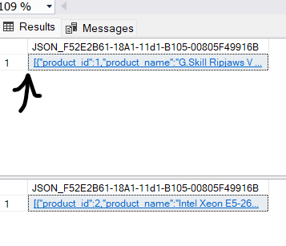
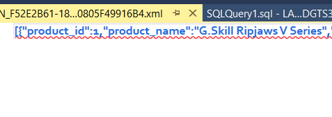
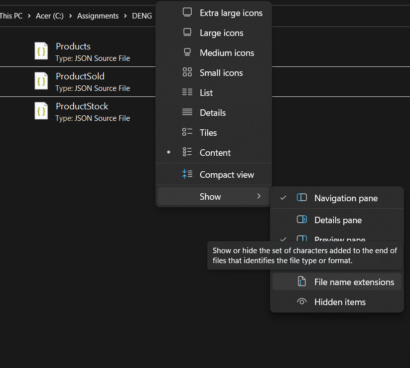
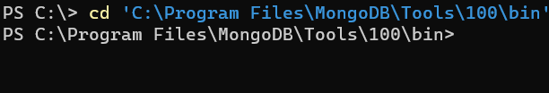
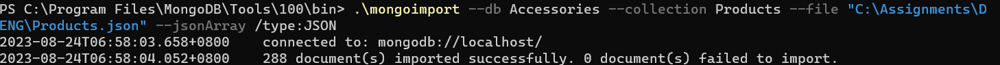

# DENG CA2 

## Assignment Brief Summary

There will be a Team component and a individual component to this assignment
### As a team you will have to : 


1. Export Data from various sources - such as excel, sql file , csv ,json , and txt into MSSQL (Provided that you have the create tables statements done first)
    - The database has to be designed in a way that has a table for each file that you are exporting
    - Should have an appendix at the end of the brief for you to refer to 
    - For e.g:
    
        
    - This table should a OLTP table
2. Design a star or snowflake schema for a data warehouse (OLAP)


3. Make the Create statements for the tables in the data warehouse(Creating the Fact table that will connect all the dimension tables together)


4. Come up with insightful queries that will be used to query the data warehouse

### Individually, you will have to :

1. Export the data from the OLTP database into a JSON file
    - The data from the OLTP Tables Should be called from the database using a command and then the output would be then saved into a JSON file in your own computer
    - For e.g:
        ```
        -- Export data from SQL Server as JSON

            SELECT 
                * 
            FROM 
                Products 
            FOR JSON AUTO;

        ```
    - This would be the command to export the data from the Products table into a JSON file
    
        

    - This would be the output of the command


    - Next, what i did was click on the blue link and it would send me to a new file on mssql.


        

    - I then saved it as a JSON file in my computer
        
    - Just incase make sure to show the file name extensions as you would need to ensure that you have the correct file name that you would be calling in the mongoimport command
    - Now go to termial and type in the following command
        ```
        cd 'C:\Program Files\MongoDB\Tools\100\bin'
        ```
        
    - This would change the directory to the bin folder in the mongoDB folder where you can then use the mongoimport command
    - Next, type in the following command
        ```
        mongoimport --db <database name> --collection <collection name> --file <file name>.json --jsonArray
        ```
        Here is an example:
        ```
        .\mongoimport --db Accessories --collection Products --file "C:\Assignments\DENG\Products.json" --jsonArray /type:JSON
        ```
        This is how it should look like on success
        


2. Import the JSON file into a NoSQL database (MongoDB)


3. Come up with insightful queries that will be used to query the NoSQL database
   - You will get the prompt for the queries from the brief 
