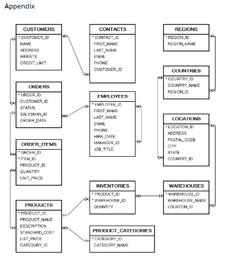

# DENG CA2 

## Assignment Brief Summary

There will be a Team component and a individual component to this assignment
### As a team you will have to : 


1. Export Data from various sources - such as excel, sql file , csv ,json , and txt into MSSQL (Provided that you have the create tables statements done first)
    - The database has to be designed in a way that has a table for each file that you are exporting
    - Should have an appendix at the end of the brief for you to refer to 
    - For e.g:
    
        
    - This table should a OLTP table
2. Design a star or snowflake schema for a data warehouse (OLAP)


3. Make the Create statements for the tables in the data warehouse(Creating the Fact table that will connect all the dimension tables together)


4. Come up with insightful queries that will be used to query the data warehouse

### Individually, you will have to :

1. Export the data from the OLTP database into a JSON file
    - The data from the OLTP Tables Should be called from the database using a command and then the output would be then saved into a JSON file in your own computer
    - For e.g:
      ```
      -- Export data from SQL Server as JSON

      SELECT
      JSON_QUERY(
          (
              SELECT
                  product_id,
                  product_name,
                  description,
                  standard_cost,
                  list_price,
                  category_id
              FOR JSON PATH
          )
      ) AS json_output
      FROM
      Products;
      ```


2. Import the JSON file into a NoSQL database (MongoDB)


3. Come up with insightful queries that will be used to query the NoSQL database
   - You will get the prompt for the queries from the brief 
