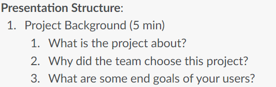

# ADES

Lets start with assignment 1:

in assignment 1 you will be doing the CRUD for your app

it would be graded based on individual functions that you have made


**You will be assessed based on the following (10% each)**

## 1. Creating entities
- Using INSERT command
## 2. Retrieving entities
- Using GET command
## 3.  Updating entities
- Using UPDATE command
## 4. Delete entities
- Using DELETE command
## 5. Building proof of concept
- Mainly referring to the html file that you made to utilize the endpoints
## 6. Concurrent requests
- Using Promise.all
    - learnt from the practical 
## 7. Sequential requests
- Using .then(output){code the uses the output} 
- for e.g.
    ```js
    module.exports.getAllHighscore = function (userid) {
    return pool
        .query("SELECT userid , gameid , highscore, score FROM record WHERE userid = ?", [userid])
        .then((result) => {
        if (result.length === 0) {
            throw new NotFoundError(`User ${userid} not found`);
        }
        return result;
        });
    };

    ```

- In the example above the .query() sends the sql query to the database and when the result is send out.

- the result is sent to the next .then(result) where the .then receives the data as a result parameter 

- And this would continue to flow as long as there is a another .then()

- where it would receive returned data as the parameter that in set in the .then bracket   


## 8. State management
- basically ChatGPT said that this is like having all your attributes declared 
properly with global attributes and local attributes allowing for good code management 
- this could also be a applied for a database , for you can change the state of a certain attribute in the table from your html and js files
- for e.g : You have a cart table in your database , and and your user checks out in the html file , you can change the state of the cart from checking out to checked out in the database from your html file.
- P.S : Double check with your teacher if this is correct.
## 9. Data manipulation
- Modifying, organizing, and transforming data for analysis through filtering, sorting, aggregation, joining, transformation, updating, inserting, and deleting operations.

- basically sql query but do more with it not just GET maybe do something like get maximum of a score or price 

## 10.  Code & Report Quality
- jus make sure your code is readable and understandable. 

- tip when doing your commits to github make sure you make your description as descriptive as possible as you might need to find a certain commit for your report 


### *P.S* Note that the css is not important in assignment 1

#

# For Assignment 2:


**You will be assessed based on the following (10% each)**

## 1. Meeting user’s needs
- Make sure that your user can get what they want from your app
- Basically make sure that your app fulfills the end goal of the project

- if your app is a game make sure that they can have fun playing it.
- if your app is a shopping app make sure that they can buy stuff from it , put stuff in the cart and checkout
- if your app is a social media app make sure that they can chat with each other and post stuff
- if your app is a food delivery app make sure that they can order food and pay for it


## 2. Product usability
- Make sure that the user can use your app with ease and that the user can understand what is going on in your app
## 3. Usability test
- Make sure that you have your usability test in your report , show the teacher what you learnt from it and what you then did to improve your app
## 4. Product functionality
- Mainly error handling and validation in the html and js files
- Possible way to get higher scores for this would be to use Rollback and Commit in the sql query so that when there is a possible error in updating important data in the database , the database would rollback to the previous state before the error occurred.   
## 5. Integration of library/frameworks
- For Frameworks and libraries, the popular ones are React, Chart.js , Stripe ,Google Maps API and socket.io .
- My teacher recommended us to try to make it so that the user can login using google or github 
- Some of my classmates used the google maps api to automatically sense the location of the user and change the language accordingly 
- Personally i used chart.js of my intergration of library/frameworks to allow the user to see their statictics in a chart form
- Some people code using react from the start , but if you want to use react you should do that from the start as it is very hard to change from html to react at the last minute
- Some others where able to allow the user to chat and play games with each other using socket.io , they where also able to allow the user to chat with each other in real time with it 
- there is also a way for you to send the user an email and use an otp to verify the user's email

# *The rest of the points are the same as assignment 1* 

## 6. Concurrent requests
## 7. Sequential requests
## 8. State management
## 9. Data manipulation
## 10. Code & Report Quality


