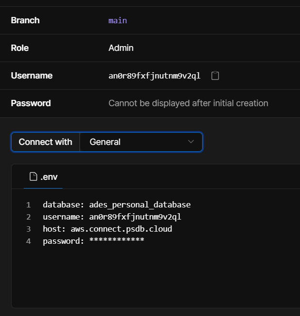

# BED Recap - Module Management

## Setup

1. Clone this repository

2. Create a .env file with the following content

    ```
    DB_USER=
    DB_PASSWORD=
    DB_HOST=
    DB_DATABASE=
    DB_CONNECTION_LIMIT=10
    PORT=3000
    ```

3. Update the .env content with your database credentials accordingly.

4. Install dependencies by running `npm install`

5. Start the app by running `npm start`

6. You should see `App listening on port 3000`

7. Using POSTMAN (or any HTTP client), send a `POST /modules/table` request to create the tables.

## Instructions

1. Open the page, `http://localhost:3000`, replace the port number accordingly if you app is not listening to port 3000

2. You should see the list of instructions on the web page.

3. Make changes, create commits, and push to the repository to submit your implementations.

## Extra Notes

In order to get the planet scale password and username, you need to create a database in planet scale and then click on the connect button. You should see the username and password there.

For E.g:

fill in the rest of the details accordingly